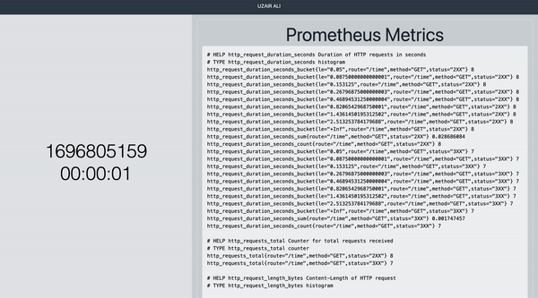

# Prometheus

> This project serves as a bridge between a frontend `React` application and a backend `Express.js` server. The backend provides an authenticated endpoint to retrieve the current server time in epoch seconds, which the frontend then displays. Additionally, it integrates Prometheus for server metrics and uses `AJV` for server response schema validation. I have also added a yaml workflow to run deployments but I need to get paid accounts to make those apis work live when deployed.

## Live Demo

[Live Demo Link](https://peppy-puffpuff-62981e.netlify.app/)

## Demo



## Built With

- React
- Express.js
- AJV
- Prometheus
- TailwindCSS
- Material-UI
- Axios

## Getting Started

To get a local copy up and running follow these simple example steps.


### Setup

```bash
# To clone the git repositories
git clone https://github.com/uzairali19/prometheus.git

# Open a new tab & install React dependencies
cd frontend && yarn

# Open a new tab & install Express.js dependencies
cd backend && yarn

# To run the development server for React
yarn start

# To run backend server
yarn start

# Finally To run tests on react
yarn test
```

***Please make sure to follow them in exact order***

## Author

👤 **Uzair Ali**

- GitHub: [@uzairali19](https://github.com/uzairali19)
- Twitter: [@uzairali751](https://twitter.com/Uzairali751)
- LinkedIn: [Uzair Ali](https://www.linkedin.com/in/uzairali19/)

## 🤝 Contributing

Contributions, issues, and feature requests are welcome!

Feel free to check the [issues page](https://github.com/uzairali19/prometheus/issues).

## Show your support

Give a ⭐️ if you like this project!

## 📝 License

This project is [MIT](./MIT.md) licensed.
